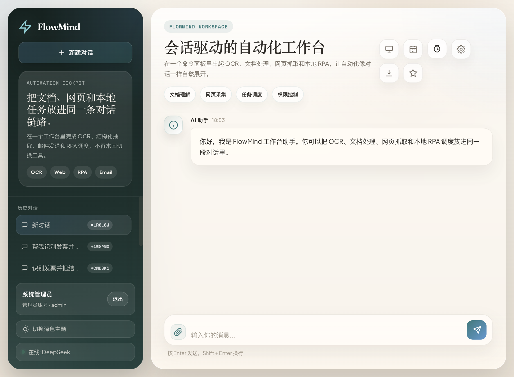
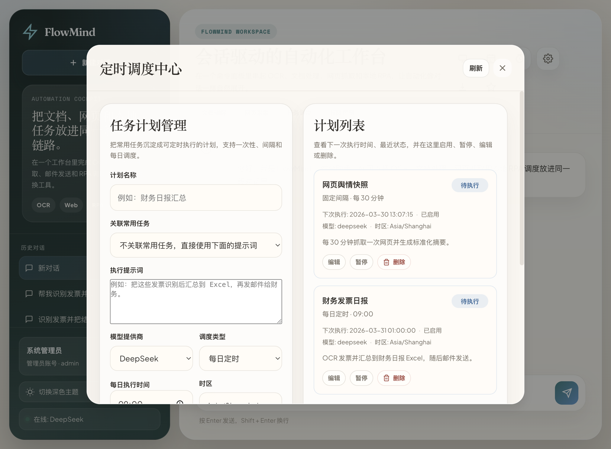
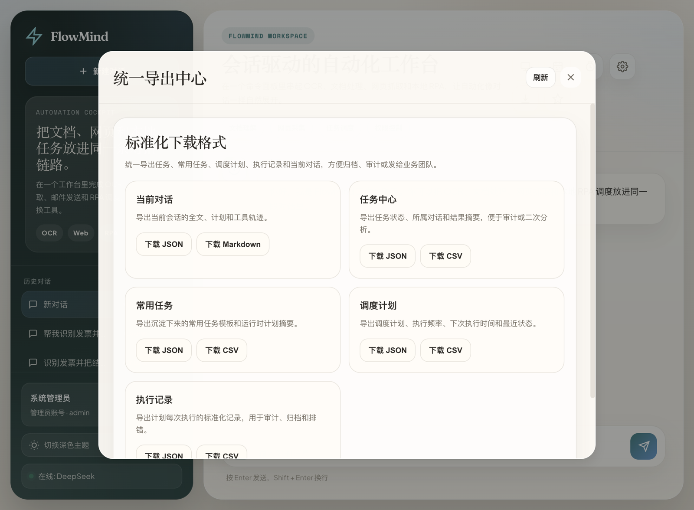

# FlowMind

> **AI Native RPA 编排系统** —— 让 RPA 更好用更智能

FlowMind 是一个将 RPA（机器人流程自动化）与 AI（人工智能）结合的编排系统，通过 MCP（Model Context Protocol）协议实现标准化的工具连接，让用户通过自然语言对话即可完成各种自动化任务。

## 核心特性

- 🤖 **AI 驱动**：自然语言对话触发 RPA，无需学习复杂的工具
- 🔧 **插件化架构**：支持自定义 RPA 插件，轻松扩展功能
- 🔗 **MCP 协议**：标准化的工具发现与调用，AI 模型可自动发现和使用工具
- 🏠 **本地执行**：RPA 插件在本地运行，数据安全可控
- 👥 **多用户支持**：管理员/业务用户角色分离，权限隔离
- 📝 **对话历史**：完整记录对话和执行过程，可追溯、可回放
- 🗺️ **工具能力地图**：插件不只暴露名称，还会向 AI 暴露输入、输出、前置条件、失败原因、批量能力与副作用信息
- 📋 **运行时执行计划**：对话中自动生成临时计划、步骤状态、恢复点和约束判断
- ♻️ **常用任务沉淀**：成功对话可保存为“常用任务”，下次一键复用
- ⏰ **定时调度中心**：可把常用任务沉淀成一次性、固定间隔或每日计划，并查看最近执行记录
- 📦 **统一导出中心**：任务、常用任务、调度计划、执行记录和当前对话都可按标准格式下载

## 功能概览

- Web 聊天界面，支持流式响应
- MCP 工具发现与调用
- 本地插件执行
- 插件脚手架与快捷接入
- 发票 OCR 识别插件
- 邮件发送插件
- Excel 处理插件
- Word 文档处理插件
- 网页查询插件
- 对话历史持久化
- 用户权限管理
- 任务状态追踪
- 运行时计划 / 约束 / 轨迹一体化展示
- 常用任务保存与复用
- 定时调度中心与任务计划管理
- 统一导出中心（JSON / CSV / Markdown）

## 界面预览

以下图片来自本地运行中的真实浏览器截图。

### Chat orchestration



### Schedule center



### Export center



## 文档导航

| 文档 | 适用人群 | 内容 |
|------|----------|------|
| [ARCHITECTURE.md](docs/ARCHITECTURE.md) | 架构师、开发者 | 系统架构设计、核心流程、技术栈 |
| [PLUGIN_DEVELOPMENT.md](docs/PLUGIN_DEVELOPMENT.md) | 插件开发者 | 插件开发指南、API 参考、最佳实践 |
| [USER_GUIDE.md](docs/USER_GUIDE.md) | 终端用户 | 用户使用指南、功能介绍、常见问题 |
| [FlowMind_操作手册.md](docs/FlowMind_操作手册.md) | 实施、运维、交付同学 | 安装配置、启动方式、项目运行说明 |
| [LICENSE](LICENSE) | 所有人 | 当前项目采用的开源许可证 |
| [PUBLISHING.md](PUBLISHING.md) | 维护者 | 首个 GitHub 公开版本的发布前清单 |
| [PUBLIC_COMMIT_FILESET.md](PUBLIC_COMMIT_FILESET.md) | 维护者 | 首个公开提交建议包含的文件列表 |
| [GITHUB_LAUNCH_COPY.md](GITHUB_LAUNCH_COPY.md) | 维护者 | GitHub、X、知乎三平台首发文案模板 |
| [CONTRIBUTING.md](CONTRIBUTING.md) | 贡献者 | 开发流程、提交建议、测试约定 |
| [SECURITY.md](SECURITY.md) | 维护者、安全研究者 | 漏洞报告与公开披露原则 |
| [CODE_OF_CONDUCT.md](CODE_OF_CONDUCT.md) | 社区参与者 | 社区协作行为准则 |

## 当前已知限制与优先改进方向

从现有文档与实现状态来看，FlowMind 已经补上了企业级自由编排的第一阶段基础能力，但还有几块能力仍值得优先补强：

1. **还没有重型流程引擎**：当前优先的是“工具能力地图 + 运行时计划 + 轨迹 + 恢复点”，还没有拖拽式流程设计器、BPMN 或流程版本中心。
2. **定时执行与结果导出已补到 V1**：当前已经有调度中心、执行记录和统一导出入口，但还没有事件触发、批量任务中心、Excel/PDF 等更重的交付格式。
3. **部署与运维文档仍以开发环境为主**：仓库已经能本地稳定运行，但 Docker / systemd / 反向代理 / TLS / 备份恢复 / 监控告警这一层还没有形成完整的上线手册。
4. **插件体系需要更多真实场景覆盖**：Excel、Word、网页查询能力已经增强，但真实文件样本、异常格式、权限边界和插件沙箱仍值得继续补。
5. **前端体验还需要真实浏览器验证**：当前 UI 已做过视觉和滚动优化，但 Chrome / Safari / 移动端的专项 E2E 与性能量化还不够。
6. **多节点工程化仍需演进**：当前权限体系已收口到 Registry，但如果后续走多机部署，仍建议把会话存储、服务鉴权和观测链路进一步独立化。

## 开源发布说明

- 公开仓库请从干净副本发布，不要直接打包当前运行目录
- 不要提交 `.env`、`agent/.env`、数据库、上传文件、日志和本地协作目录
- 当前仓库已经把 `.claude/`、`.codex-enterprise/`、`logs/`、`data/uploads/` 等内部资产加入忽略规则
- 当前仓库采用 [MIT License](LICENSE)
- 发布前请确认 README 中的对外口径、仓库名和截图素材符合预期
- 更完整的发布动作见 [PUBLISHING.md](PUBLISHING.md)
- 多平台首发文案模板见 [GITHUB_LAUNCH_COPY.md](GITHUB_LAUNCH_COPY.md)
- GitHub Social Preview 图可直接使用 `docs/assets/social-preview.jpg`

## 企业级自由编排基础

当前版本已经具备下面这几块对企业应用更重要的基础能力：

- **工具能力地图**：每个插件都可以向 AI 描述“解决什么问题、适合什么输入、输出什么、前置条件、常见失败原因、是否支持批量、是否有副作用、是否需要确认”。
- **运行时执行计划**：用户一句自然语言请求进入聊天链路后，系统会在后台生成临时计划并随步骤更新状态。
- **约束与边界**：对话编排链路会检查权限、关键参数、路径范围、步骤上限和高风险动作确认。
- **执行轨迹可视化**：前端消息里会同时展示计划、工具轨迹、约束告警和恢复建议。
- **常用任务沉淀**：成功对话可以保存为常用任务，下次预填复用。
- **失败恢复骨架**：系统会记录步骤状态、任务 ID、恢复建议和可继续节点，避免所有失败都整条重跑。
- **定时调度中心**：常用任务可以继续沉淀为一次性、固定间隔或每日计划，由 Web 执行器按当前账号权限定时触发。
- **统一导出中心**：任务、常用任务、计划、执行记录和当前对话可直接下载为 JSON / CSV / Markdown。
- **机器可见性分层**：管理员可看全量机器；业务账号可查看与自己已授权插件相关的在线机器。

## 插件快速接入

如果你已经启动了 Web 管理端，也可以直接使用“账号权限中心”里的“插件接入向导”：

1. 使用管理员账号登录
2. 打开右上角星形按钮进入“账号权限中心”
3. 在“插件接入向导”里填写插件 ID、描述，以及二选一的接入方式
4. 如果已有 Python RPA 文件，直接填绝对路径；如果还没有实现，就填写参数定义生成空骨架
5. 如果要装到指定 Agent，上一步可以直接选择目标机器
6. 提交后系统会自动生成 `manifest.yaml`、插件入口文件，并把 manifest 写入 Registry 元数据
7. 重启 Agent 后，新插件就会完成注册并出现在可用工具列表中

注意：插件 ID 目前建议使用“字母开头 + 字母/数字/下划线”的形式，例如 `weather_api`。

说明：
- 插件脚手架的实现归属在 `agent/`，Web 向导只是单机/同机部署场景下的便捷入口。
- 如果 Agent 是独立部署的，请直接在 Agent 节点执行下面的 CLI 命令，不要依赖 Web 进程替你写入远端 `agent/plugins/`。
- 如果要在 Web 向导里按机器选择目标 Agent，请给每台 Agent 配置自己的 `AGENT_ADMIN_PUBLIC_URL`，并优先把对应 token 放进独立 token store 文件。

如果你已经写好了一个 Python RPA 文件，可以直接用脚手架命令把它包装成 FlowMind 插件：

```bash
./.venv/bin/python -m agent.scaffold_plugin weather_api \
  --description "天气查询插件" \
  --source-file /path/to/weather_rpa.py
```

如果你还没有现成实现，也可以先生成一个空插件骨架：

```bash
./.venv/bin/python -m agent.scaffold_plugin weather_api \
  --description "天气查询插件" \
  --param city:string \
  --required city
```

脚手架会自动在 `agent/plugins/` 下生成插件目录、`manifest.yaml` 和 `__init__.py`。更完整的用法见 [PLUGIN_DEVELOPMENT.md](docs/PLUGIN_DEVELOPMENT.md)。

## 系统架构

FlowMind 采用分布式架构，分为三个核心组件：

```text
                    ┌─────────────────────────┐
                    │   Client (Web UI)       │
                    │  - Web 聊天界面         │
                    │  - AI 调用层            │
                    └─────────────┬───────────┘
                                  │
                                  │ HTTP/SSE
                                  │
                    ┌─────────────▼───────────┐
                    │  Registry (MCP Server)  │
                    │  - 注册中心             │
                    │  - 任务调度             │
                    │  - 数据持久化           │
                    └─────────────┬───────────┘
                                  │
                                  │ WebSocket
                                  │
                    ┌─────────────▼───────────┐
                    │  Agent (Plugin Executor)│
                    │  - 插件加载             │
                    │  - RPA 执行             │
                    └─────────────────────────┘
```

**组件说明**：
- **Registry** (`/registry/`): 注册中心和 MCP 工具服务
- **Agent** (`/agent/`): 本地插件执行器
- **Client** (`/client/`): Web 聊天界面和 AI 调用层

## 目录结构

```text
FlowMind/
├── agent/
│   ├── .env.example     # Agent 专属环境变量示例
│   ├── main.py          # Agent 启动入口
│   ├── executor.py      # 插件执行器
│   ├── plugin_scaffold.py # Agent 自有插件脚手架实现
│   └── plugins/         # RPA 插件目录
├── client/
│   ├── web_server.py    # Web 服务器
│   ├── web_server_chat.py  # 聊天编排
│   ├── ai_manager.py    # AI 服务管理器
│   └── web/             # 前端资源
├── registry/
│   ├── main.py          # Registry 服务器
│   ├── db.py            # 数据库操作
│   ├── dispatch.py      # 任务调度引擎
│   └── mcp_transport.py # MCP 传输层
├── utils/
│   ├── logger.py        # 日志工具
│   ├── paths.py         # 路径工具
│   └── plugin_result.py # 插件结果封装
├── docs/                # 文档目录
│   ├── ARCHITECTURE.md
│   ├── FlowMind_操作手册.md
│   ├── PLUGIN_DEVELOPMENT.md
│   └── USER_GUIDE.md
├── data/                # 运行时数据目录（数据库、上传文件）
├── logs/                # 日志目录
├── .env.example
├── requirements.txt
├── run_stable.py        # Registry + Web 稳定启动脚本
├── run_agent.py         # Agent 独立启动脚本
└── README.md
```

## 快速开始

### 环境要求

- Python 3.11+
- Windows / macOS / Linux
- 互联网连接（用于 AI 和 MCP 通信）

### 1. 克隆项目

```bash
git clone <repository-url>
cd FlowMind
```

如果你打算对外公开这个项目，建议先从一个新的干净目录克隆或复制源码，再初始化 Git 仓库并提交首个开源版本。

### 2. 创建虚拟环境

```bash
# Windows (PowerShell / CMD)
py -3.11 -m venv .venv
.\.venv\Scripts\activate

# macOS / Linux
python3.11 -m venv .venv
source .venv/bin/activate
```

### 3. 安装依赖

```bash
pip install -r requirements.txt
```

### 4. 配置环境变量

```bash
# 复制示例配置
# Windows
copy .env.example .env
copy agent\.env.example agent\.env

# macOS / Linux
cp .env.example .env
cp agent/.env.example agent/.env
```

编辑根目录 `.env` 文件，至少配置以下内容：

```bash
# AI 提供商（至少配置一个）
DEEPSEEK_API_KEY=your_deepseek_api_key
# ARK_API_KEY=your_ark_api_key  # 可选

# 管理员账号
FLOWMIND_ADMIN_USERNAME=admin
FLOWMIND_ADMIN_PASSWORD=your_password

# 安全密钥
SECRET_KEY=your_secret_key_here

# 定时调度中心（可选）
FLOWMIND_SCHEDULER_ENABLED=true
FLOWMIND_SCHEDULER_POLL_SECONDS=20
```

Agent 相关配置请放在 `agent/.env`：

```bash
REGISTRY_URL=ws://127.0.0.1:8000/ws
MACHINE_ID=local-dev-machine
FLOWMIND_AGENT_WS_TOKEN=replace-with-shared-agent-ws-token
AGENT_ADMIN_ENABLED=true
AGENT_ADMIN_HOST=127.0.0.1
AGENT_ADMIN_PORT=8765
# AGENT_ADMIN_PUBLIC_URL=https://agent-a.example.com
# AGENT_ADMIN_TOKEN=replace-with-a-random-token
# OCR_API_URL=http://your-ocr-api-url
# SMTP_SERVER=smtp.example.com
```

### 5. 启动系统

```bash
# 使用启动脚本（推荐）
# 终端 1：启动 Registry + Web
# Windows
.\.venv\Scripts\python.exe run_stable.py

# macOS / Linux
./.venv/bin/python run_stable.py

# 终端 2：单独启动 Agent（会同时托管 Agent 执行进程和 Agent 管理 API）
# Windows
.\.venv\Scripts\python.exe run_agent.py

# macOS / Linux
./.venv/bin/python run_agent.py
```

### 6. 访问系统

打开浏览器，访问：**http://127.0.0.1:5173**

使用配置的管理员账号登录即可开始使用！

---

详细使用说明请参考：[USER_GUIDE.md](docs/USER_GUIDE.md)

## 配置

复制示例配置：

```bash
# Windows
copy .env.example .env

# macOS / Linux
cp .env.example .env
```

推荐至少配置以下变量：

- `DEEPSEEK_API_KEY` 或 `ARK_API_KEY`
- `REGISTRY_API_URL`
- `SECRET_KEY` 或 `FLOWMIND_INTERNAL_API_TOKEN`
- `FLOWMIND_ADMIN_USERNAME`
- `FLOWMIND_ADMIN_PASSWORD`
- `FLOWMIND_SCHEDULER_ENABLED`（可选，默认 `true`）
- `FLOWMIND_SCHEDULER_POLL_SECONDS`（可选，默认 `20`）
- `FLOWMIND_SCHEDULER_CLAIM_BATCH_SIZE`（可选，默认 `3`）
- `FLOWMIND_SCHEDULER_SESSION_TTL_SECONDS`（可选，默认 `7200`）

Agent 专属变量请配置到 `agent/.env`：

- `REGISTRY_URL`
- `MACHINE_ID`
- `FLOWMIND_AGENT_WS_TOKEN`（Registry 与 Agent 之间的 WebSocket 认证 token，推荐必配）
- `AGENT_HEARTBEAT_INTERVAL_SEC`
- `AGENT_ADMIN_ENABLED`
- `AGENT_ADMIN_HOST`
- `AGENT_ADMIN_PORT`
- `AGENT_ADMIN_PUBLIC_URL`（按机器选择安装目标时推荐配置）
- `AGENT_ADMIN_TOKEN`（远端调用时强烈建议配置）

如果希望让 Web 管理端通过远端 Agent 管理 API 生成插件，请在根目录 `.env` 额外配置：

- `AGENT_ADMIN_API_URL`
- `AGENT_ADMIN_TOKEN_STORE_PATH`（推荐，默认读取 `data/agent_admin_tokens.json`）
- `AGENT_ADMIN_API_TOKEN`
- `AGENT_ADMIN_API_TOKENS_JSON`（兼容旧配置）

此外，Registry 侧 `.env` 需要与每台 Agent 共享同一个 `FLOWMIND_AGENT_WS_TOKEN`，否则 Agent 会在注册阶段被 WebSocket 拒绝。

如果要在多台 Agent 之间按机器选择安装目标：

- 每台 Agent 都要配置各自的 `AGENT_ADMIN_PUBLIC_URL`
- Web 推荐把 token 放到 `data/agent_admin_tokens.json`
- 可直接参考 [data/agent_admin_tokens.example.json](data/agent_admin_tokens.example.json)
- 运行态文件建议执行 `chmod 600 data/agent_admin_tokens.json`
- 样例文件已经包含 `updated_at`、`default_rotated_at`、每台机器的 `rotated_at` / `note`
- 如果 token store 中没有对应机器条目，系统仍会回退到 `AGENT_ADMIN_API_TOKENS_JSON` 和共享 `AGENT_ADMIN_API_TOKEN`
- 管理员可通过 `GET /api/admin/agent-admin-token-store` 查看脱敏后的 token store 状态与告警

如果要启用 OCR：

- 配置到 `agent/.env`
- `OCR_API_URL`
- `OCR_API_TIMEOUT`

如果要启用邮件：

- 配置到 `agent/.env`
- `SMTP_SERVER`
- `SMTP_PORT`
- `SMTP_USER`
- `SMTP_PASSWORD`

权限与登录相关的可选变量：

- `FLOWMIND_SESSION_TTL_SECONDS`
- `FLOWMIND_SESSION_COOKIE`
- `FLOWMIND_SESSION_COOKIE_SECURE`

如果没有配置 `FLOWMIND_ADMIN_PASSWORD`，系统会在首次初始化时于 `data/bootstrap_admin_password.txt` 生成一次性 bootstrap 管理员凭据文件。

如果 `agent/.env` 不存在，可以从 `agent/.env.example` 复制一份开始。

## 启动

方式一，分别启动三个服务：

```bash
# Windows
.\.venv\Scripts\python.exe -m uvicorn registry.main:app --host 127.0.0.1 --port 8000
.\.venv\Scripts\python.exe -m agent.main
.\.venv\Scripts\python.exe -m agent.admin_server
.\.venv\Scripts\python.exe -m client.web_server

# macOS / Linux
./.venv/bin/python -m uvicorn registry.main:app --host 127.0.0.1 --port 8000
./.venv/bin/python -m agent.main
./.venv/bin/python -m agent.admin_server
./.venv/bin/python -m client.web_server
```

方式二，使用启动脚本：

```bash
# 终端 1：Registry + Web
# Windows
.\.venv\Scripts\python.exe run_stable.py

# macOS / Linux
./.venv/bin/python run_stable.py

# 终端 2：Agent
# Windows
.\.venv\Scripts\python.exe run_agent.py

# macOS / Linux
./.venv/bin/python run_agent.py
```

仅运行 `run_stable.py` 时，Web 界面可以打开，但不会有在线 Agent，工具调用会保持等待状态。
默认使用 `run_agent.py` 时，会同时启动 Agent 执行进程和最小 Agent 管理 API；如果不需要管理 API，可在 `agent/.env` 中将 `AGENT_ADMIN_ENABLED=false`。

## 文档阅读建议

- 想快速跑起来：先看本文档和 [USER_GUIDE.md](docs/USER_GUIDE.md)
- 想理解系统边界和未来改进方向：看 [ARCHITECTURE.md](docs/ARCHITECTURE.md)
- 想交付给实施或运维同学：看 [FlowMind_操作手册.md](docs/FlowMind_操作手册.md)

Web UI 默认地址：

```text
http://127.0.0.1:5173
```

## 运行时文件

默认运行产物会写入：

- `data/registry.db`
- `data/uploads/`
- `logs/`

这些目录属于运行时文件，不应作为源码的一部分进行维护。

## 测试说明

当前公开仓库不附带 `tests/` 目录。

如果你在自己的私有分支里补充回归或二次开发测试，项目根目录仍保留了 `pytest.ini`，可以继续按 `pytest` 约定组织测试文件。
