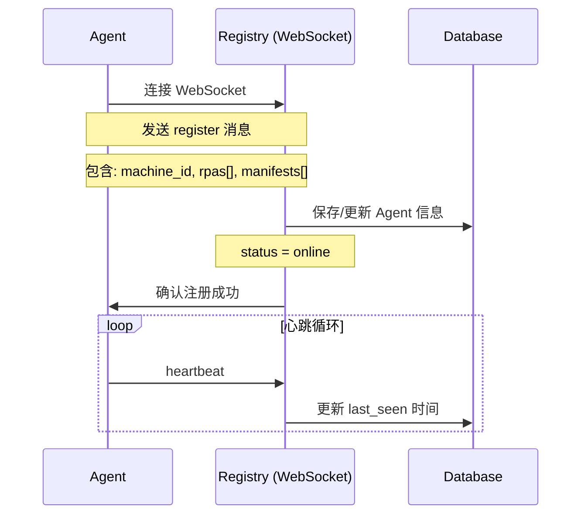
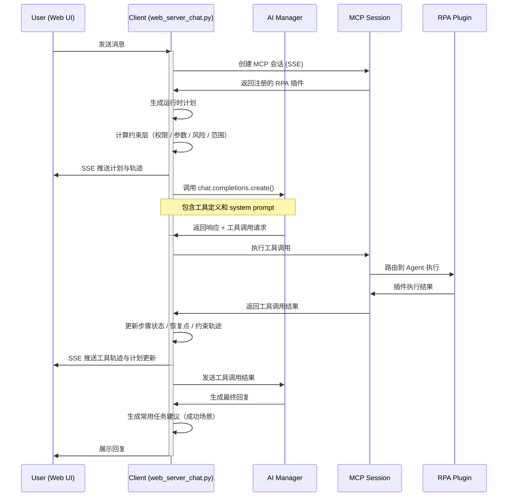
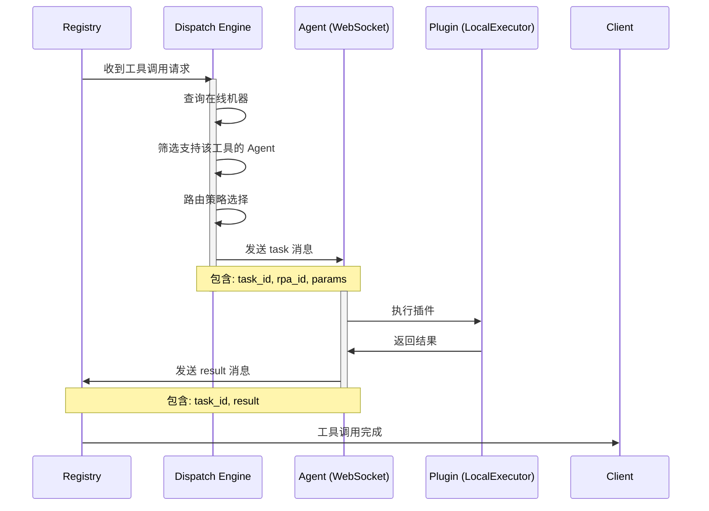

# FlowMind 架构设计文档

## 1. 项目概述

FlowMind 是一个 AI Native RPA（机器人流程自动化）编排系统，将 RPA 的自动化能力与 AI 的自然语言理解相结合，通过 MCP（Model Context Protocol）协议实现标准化的工具连接，让 RPA 变得更好用更智能。

**核心理念**：
- 自然语言驱动的流程自动化
- 标准化的工具发现与调用
- 本地执行的安全性保证
- 多用户权限隔离

## 2. 系统架构

FlowMind 采用分布式架构，分为三个核心组件：

### 2.1 Registry（注册中心 & MCP 工具服务）

**文件位置**：`/registry/`

**核心职责**：
- RPA 插件元数据管理（注册、查询、更新）
- Agent 管理（注册、心跳、状态监控）
- 任务调度与路由（Dispatch 引擎）
- MCP 服务器实现
- 对话历史持久化
- 用户权限与会话管理

**关键类与模块**：
- `main.py`: FastAPI 应用入口，MCP 服务器初始化
- `db.py`: SQLite 数据库操作
- `dispatch.py`: 任务调度引擎
- `mcp_transport.py`: MCP 传输层实现（SessionBoundSseTransport）
- `models.py`: 数据模型定义

### 2.2 Agent（本地插件执行器）

**文件位置**：`/agent/`

**核心职责**：
- 插件发现与加载（LocalExecutor）
- 与 Registry 建立 WebSocket 连接
- 执行 RPA 插件
- 结果返回

**关键类与模块**：
- `main.py`: Agent 启动入口，Websocket 连接管理
- `admin_server.py`: Agent 最小管理 API，用于远端插件脚手架/安装
- `executor.py`: LocalExecutor 插件执行器
- `plugin_scaffold.py`: Agent 本地插件脚手架与 manifest 生成
- `plugins/`: RPA 插件目录（包含多个子目录）

### 2.3 Client（Web 聊天界面 & AI 调用层）

**文件位置**：`/client/`

**核心职责**：
- Web UI 展示与交互
- AI 服务集成（DeepSeek、火山引擎）
- MCP 客户端会话管理
- 对话运行时编排（动态计划、约束、轨迹）
- 用户认证与授权
- 常用任务沉淀与复用

**关键类与模块**：
- `web_server.py`: FastAPI Web 服务器
- `web_auth.py`: 认证与授权
- `web_server_chat.py`: 聊天运行时编排、计划生成与 SSE 轨迹输出
- `web_server_tooling.py`: 工具路由、能力地图与约束检查
- `orchestration_runtime.py`: 运行时计划、恢复状态与常用任务建议
- `ai_manager.py`: AI 服务管理器
- `web/`: 前端静态资源

## 3. 技术栈

| 层级 | 技术 | 用途 |
|------|------|------|
| **后端框架** | FastAPI | 高性能 API 服务 |
| **通信协议** | WebSocket | Agent ↔ Registry 双向通信 |
| | Server-Sent Events (SSE) | Client ↔ Registry 流式传输 |
| **MCP 实现** | Python MCP SDK | 标准化工具连接 |
| **AI 集成** | OpenAI 兼容 API | 支持 DeepSeek、火山引擎 |
| **数据库** | SQLite | 轻量级持久化 |
| **多用户** | Cookie 会话 | 支持 admin/business 角色 |
| **日志** | Loguru | 结构化日志 |

## 4. 核心工作流程

### 4.1 Agent 启动与注册流程



### 4.2 用户对话流程



### 4.4 企业级自由编排基础

当前版本没有走“先画流程图再执行”的重型 BPM 路线，而是优先补下面这几层运行时能力：

1. **工具能力地图**：插件向 AI 暴露解决问题、适合输入、输出、前置条件、失败原因、批量能力、副作用与确认要求。
2. **运行时计划**：每轮对话在后台生成临时计划，步骤会随着工具调用实时更新。
3. **约束层**：在真正执行工具前检查权限、关键参数、路径范围、步骤上限和高风险确认。
4. **可观察轨迹**：前端消息中同时展示计划、工具轨迹、约束告警和恢复建议。
5. **常用任务沉淀**：成功对话可保存为常用任务，而不是要求业务用户先画流程。
6. **失败恢复骨架**：步骤状态、任务 ID 与恢复建议会写回消息 meta，支持断点观察与续跑基础。

### 4.3 插件执行流程



## 5. 数据模型

### 5.1 数据库结构

**registry.db 包含以下表**：

| 表名 | 用途 | 关键字段 |
|------|------|----------|
| `conversations` | 对话记录 | `id`, `title`, `user_id`, `created_at` |
| `messages` | 消息记录 | `id`, `conversation_id`, `role`, `content`, `created_at` |
| `tasks` | 任务记录 | `id`, `rpa_id`, `task_id`, `machine_id`, `status`, `created_at` |
| `machines` | 在线机器 | `id`, `machine_id`, `last_seen`, `status` |
| `rpas` | RPA 元数据 | `id`, `rpa_id`, `machine_id`, `manifest`, `status` |
| `users` | 用户信息 | `id`, `username`, `password_hash`, `role`, `display_name` |
| `user_sessions` | 会话管理 | `id`, `user_id`, `token`, `expires_at` |
| `common_tasks` | 常用任务模板 | `id`, `title`, `prompt`, `summary`, `plan`, `owner_user_id` |
| `task_schedules` | 定时调度计划 | `id`, `title`, `prompt`, `schedule_type`, `schedule_config`, `next_run_at`, `owner_user_id` |
| `task_schedule_runs` | 调度执行记录 | `id`, `schedule_id`, `status`, `planned_for`, `conversation_id`, `response_text` |

补充说明：

- `messages.meta` 现在不仅存 `tool_trace`，还会携带 `runtime_plan` 和 `reusable_task_suggestion`。
- `rpas.manifest` 现在支持 `tool_profile`，用于描述企业级编排所需的工具能力地图。
- `task_schedules` 由 Registry 持久化，Web 侧调度执行器按计划认领并以用户真实 session 运行。
- `task_schedule_runs` 会保存计划每次执行的状态、对话、轨迹和错误文本，供审计与导出中心复用。

### 5.2 会话与权限

- **Session Token**: 用户登录后获取，过期时间由 `FLOWMIND_SESSION_TTL_SECONDS` 配置
- **权限等级**：
  - `admin`: 管理员，可管理用户和所有插件
  - `business`: 普通用户，只能使用分配的插件
- **插件授权**：用户 ↔ RPA 插件 的多对多关系

## 6. 配置管理

### 6.1 环境变量

核心配置文件分为两层：

- 根目录 `.env`：Registry / Web / 共享安全配置
- `agent/.env`：Agent 连接 Registry 与插件侧配置

**根目录 `.env` 必填项**：
```bash
# AI 提供商
DEEPSEEK_API_KEY=         # DeepSeek API 密钥
ARK_API_KEY=              # 火山引擎 API 密钥（可选）

# 服务器配置
REGISTRY_API_URL=http://127.0.0.1:8000

# 安全配置
SECRET_KEY=your-secret-key
FLOWMIND_ADMIN_USERNAME=admin
FLOWMIND_ADMIN_PASSWORD=password
```

**`agent/.env` 关键项**：
```bash
REGISTRY_URL=ws://127.0.0.1:8000/ws
MACHINE_ID=local-dev-machine
AGENT_HEARTBEAT_INTERVAL_SEC=10
AGENT_ADMIN_ENABLED=true
AGENT_ADMIN_HOST=127.0.0.1
AGENT_ADMIN_PORT=8765
AGENT_ADMIN_PUBLIC_URL=https://agent-a.example.com
# AGENT_ADMIN_TOKEN=replace-with-a-random-token

# OCR 服务（插件侧）
OCR_API_URL=
OCR_API_TIMEOUT=15

# 邮件服务（插件侧）
SMTP_SERVER=
SMTP_PORT=
SMTP_USER=
SMTP_PASSWORD=
```

**根目录 `.env` 可选项**：
```bash
# 会话配置
FLOWMIND_SESSION_TTL_SECONDS=86400
# 调度中心
FLOWMIND_SCHEDULER_ENABLED=true
FLOWMIND_SCHEDULER_POLL_SECONDS=20
FLOWMIND_SCHEDULER_CLAIM_BATCH_SIZE=3
FLOWMIND_SCHEDULER_SESSION_TTL_SECONDS=7200
# Registry 侧清理在线 Agent 的参数
AGENT_HEARTBEAT_TIMEOUT_SEC=45
AGENT_HEARTBEAT_SWEEP_INTERVAL_SEC=15
# 如果 Web 需要通过远端 Agent 管理 API 生成插件
AGENT_ADMIN_API_URL=http://agent-host:8765
AGENT_ADMIN_TOKEN_STORE_PATH=data/agent_admin_tokens.json
# 兼容旧配置：
AGENT_ADMIN_API_TOKEN=replace-with-agent-admin-token
AGENT_ADMIN_API_TOKENS_JSON='{"machine-a":"token-a","machine-b":"token-b"}'
```

### 6.2 运行时文件

- `data/registry.db`: SQLite 数据库
- `data/uploads/`: 用户上传的文件
- `logs/`: 系统日志
- `data/bootstrap_admin_password.txt`: 首次启动时生成的临时密码

## 7. 部署与运行

### 7.1 环境要求

- Python 3.11+
- Windows 或 macOS/Linux（推荐 Windows 用于桌面 RPA）
- 网络连接（用于 AI 和 MCP 通信）

### 7.2 安装步骤

```bash
# 1. 创建虚拟环境
python3.11 -m venv .venv

# 2. 激活虚拟环境
# Windows
.\.venv\Scripts\activate
# macOS/Linux
source .venv/bin/activate

# 3. 安装依赖
pip install -r requirements.txt

# 4. 配置环境变量
cp .env.example .env
# 编辑 .env 文件，填入必要配置

# 5. 启动服务（方式一：分别启动）
./.venv/bin/python -m uvicorn registry.main:app --host 127.0.0.1 --port 8000 &
./.venv/bin/python -m agent.main &
./.venv/bin/python -m client.web_server &

# 方式二：使用启动脚本
./.venv/bin/python run_stable.py
./.venv/bin/python run_agent.py
```

### 7.3 访问

- **Web UI**: http://127.0.0.1:5173
- **API 文档**: http://127.0.0.1:8000/docs

## 8. 插件开发

### 8.1 插件结构

每个插件是一个独立的目录，包含以下文件：

```
agent/plugins/{插件名}/
├── __init__.py          # 插件实现（必须包含 async def run()）
├── manifest.yaml        # 插件元数据
└── [其他资源文件]
```

### 8.2 脚手架归属边界

- 插件脚手架实现归 `agent/plugin_scaffold.py` 所有，因为它本质上是在 Agent 本地文件系统里生成插件目录和 `manifest.yaml`。
- `client` 侧的“插件接入向导”只应被视为同机部署时的便捷入口，而不是 Agent 插件安装能力的真实归属。
- 若 Agent 独立部署在远端机器，优先通过 Agent 自己的最小管理 API 或直接在 Agent 节点执行 `python -m agent.scaffold_plugin ...`；不要让 Client 直接写远端 `agent/plugins/`。
- 若要在 Web 管理端中“按机器选择目标 Agent”，每台 Agent 需要通过 `AGENT_ADMIN_PUBLIC_URL` 向 Registry 暴露自己的管理地址，Web 服务则优先从独立 token store 文件中按 `machine_id` 解析 token。
- token 解析优先级为：
  - `AGENT_ADMIN_TOKEN_STORE_PATH` 指向的 JSON 文件
  - `AGENT_ADMIN_API_TOKENS_JSON`
  - `AGENT_ADMIN_API_TOKEN`
- token store 建议包含 `updated_at`、`default_rotated_at` 和每台机器的 `rotated_at`
- 在 POSIX 环境下建议对运行态 token store 使用 `chmod 600`
- Web 提供管理员只读检查接口：`GET /api/admin/agent-admin-token-store`

### 8.3 manifest.yaml 格式

```yaml
id: invoice_ocr                    # 唯一标识符
version: "1.0.0"                   # 版本
description: "发票 OCR 识别"       # 描述
tags: ["ocr", "发票", "财务"]     # 标签
capabilities: ["ocr", "invoice"]  # 能力列表

# 强制调用策略
enforcement:
  must_call_when_matched: true
  require_success_before_final: true
  intent_keywords: ["ocr", "识别发票", "发票识别"]

# 参数与返回值 Schema
params_schema:
  type: object
  properties:
    invoice_path:
      type: string
      description: "发票文件路径"
  required: ["invoice_path"]

returns_schema:
  type: object
  properties:
    status:
      type: string
    data:
      type: object

timeout_sec: 60                     # 超时时间
owner: "system"                     # 插件所有者
```

### 8.3 __init__.py 实现

```python
import asyncio
from utils.logger import setup_logger
from utils.plugin_result import success_result, error_result

logger = setup_logger("InvoiceOCR", "invoice_ocr.log")

async def run(invoice_path: str, output_format: str = "json") -> dict:
    # 参数验证
    if not invoice_path:
        return error_result("invoice_path is required")

    # 业务逻辑
    try:
        result = await do_ocr(invoice_path)
        return success_result(data=result)
    except Exception as e:
        logger.error(f"OCR failed: {e}")
        return error_result(str(e))
```

### 8.4 插件生命周期

1. 加载：Agent 启动时由 LocalExecutor 扫描并加载
2. 注册：Agent 连接 Registry 时上报插件信息
3. 发现：MCP 会话初始化时获取所有注册的插件
4. 调用：AI 工具调用 → MCP 执行 → Agent 执行
5. 卸载：Agent 停止时从 Registry 中注销

## 9. 开发与调试

### 9.1 启动方式

**开发模式**：
```bash
# 启用自动重载
uvicorn registry.main:app --host 127.0.0.1 --port 8000 --reload
python -m agent.main --debug
python -m client.web_server --debug
```

### 9.2 日志查看

```bash
# 查看主要服务日志
tail -f logs/registry.log
tail -f logs/agent.log
tail -f logs/web_server.log

# 查看插件日志
tail -f logs/invoice_ocr.log
```

### 9.3 测试

```bash
# 运行所有测试
./.venv/bin/python -m pytest -q

# 运行特定测试
./.venv/bin/python -m pytest -q tests/test_web_server.py
./.venv/bin/python -m pytest -q tests/test_registry_main.py
```

## 10. 架构优化建议

### 10.1 当前最优先的架构补强

1. **工作流编排落地**
   - 当前系统更偏“聊天触发工具”
   - 当前已经有运行时计划、调度中心和执行记录
   - 仍缺可视化流程设计器、流程版本管理和更复杂的事件触发

2. **部署与运维工程化**
   - 当前更适合开发机或单机试运行
   - 仍缺 Docker / Compose、进程守护、反向代理、TLS、备份恢复、监控告警手册

3. **真实浏览器与前端质量保障**
   - 当前 UI 已优化视觉和滚动体验
   - 仍需 Chrome / Safari / 移动端 E2E、性能面板采样、关键路径自动化回归

### 10.2 中期扩展方向

1. **插件体系继续实战化**
   - 增加更多真实文件与页面样本覆盖
   - 强化 Excel / Word / 网页抽取类插件的异常格式处理
   - 增加插件资源访问约束和执行隔离

2. **多节点与共享状态演进**
   - 当前权限边界已经收口到 Registry
   - 若继续多机部署，建议把会话存储、服务鉴权、任务状态观测进一步独立化

3. **调度层增强**
   - 当前已经有定时调度中心、计划记录和执行轨迹
   - 下一步更适合增加任务优先级、失败重试策略和更细粒度的并发控制

### 10.3 长期能力建设

1. **插件市场与生态**
   - 插件上传/下载
   - 插件版本管理
   - 插件评分与评论

2. **企业级平台能力**
   - 多租户隔离
   - 资源配额管理
   - 审计、合规与报表能力

3. **安全加固**
   - 插件执行沙箱
   - 存储加密与敏感数据脱敏
   - 在已有导出中心基础上继续补更完善的操作审计与脱敏下载能力

## 11. 总结

FlowMind 是一个创新的 AI Native RPA 编排系统，通过 MCP 协议实现了 AI 与自动化工具的标准化连接。其核心优势包括：

1. **易用性**：自然语言驱动的流程自动化
2. **安全性**：本地执行 + 权限隔离
3. **标准化**：MCP 协议 + 统一接口
4. **可扩展性**：插件化架构 + 模块化设计

该架构为企业提供了一个安全、可控的 AI 自动化平台，同时保持了足够的灵活性来适应不同的业务场景。
